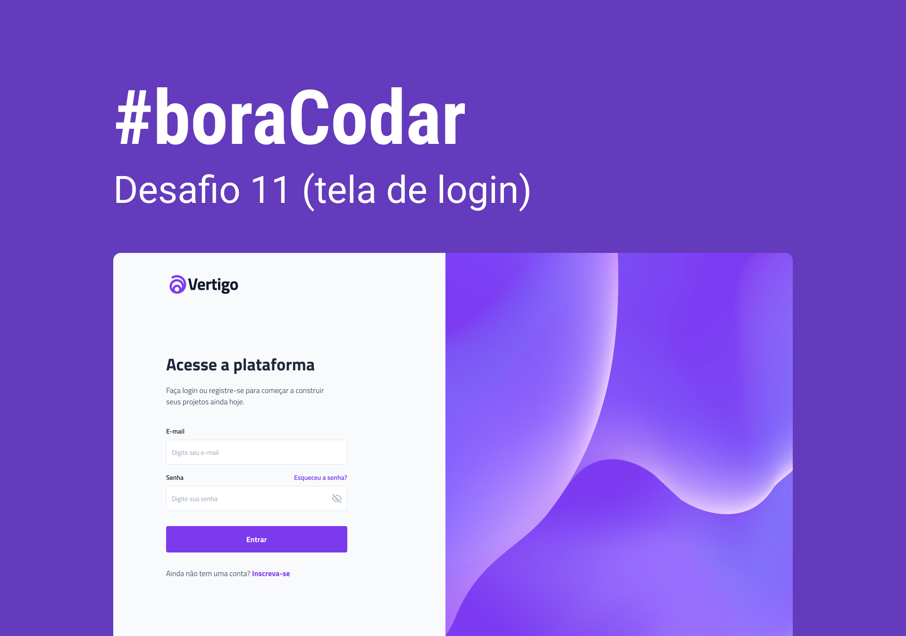

<h1 align="center"> Desafio 11 Criar uma tela de login com HTML, CSS e JS </h1>

Projeto afim de desenvolver mais as habilidades em HTML CSS JS

  <a href="#-tecnologias">Tecnologias</a>&nbsp;&nbsp;&nbsp;|&nbsp;&nbsp;&nbsp;
  <a href="#-projeto">Projeto</a>&nbsp;&nbsp;&nbsp;|&nbsp;&nbsp;&nbsp;
  <a href="#-layout">Layout</a>&nbsp;&nbsp;&nbsp;|&nbsp;&nbsp;&nbsp;
  <a href="#memo-licença">Licença</a>

  

 

  

## 🚀 Tecnologias

Esse projeto foi desenvolvido com as seguintes tecnologias:

- HTML CSS e JS

## 💻 Projeto

Desafio da RocketSeat para desenvolver uma tela de login

## 🔖 Layout

Você pode visualizar o layout do projeto através [DESSE LINK](https://www.figma.com/file/CzXWVs2blo4VAwxcxXjNqK/%23boracodar---Desafio-11-(Community)?node-id=11%3A31&t=EKZvvaoWQ1IdPC5P-1). É necessário ter conta no [Figma](https://figma.com) para acessá-lo.

## :memo: Licença

Esse projeto está sob a licença MIT.

---